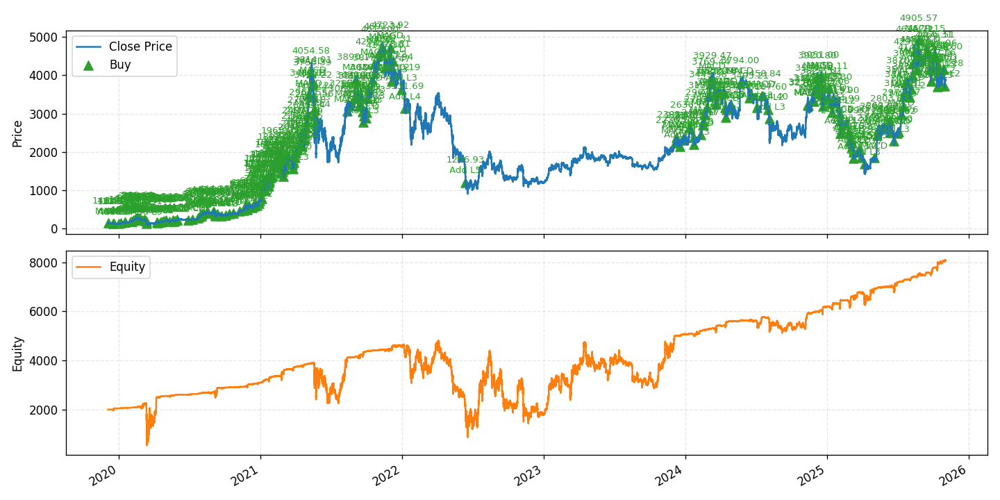
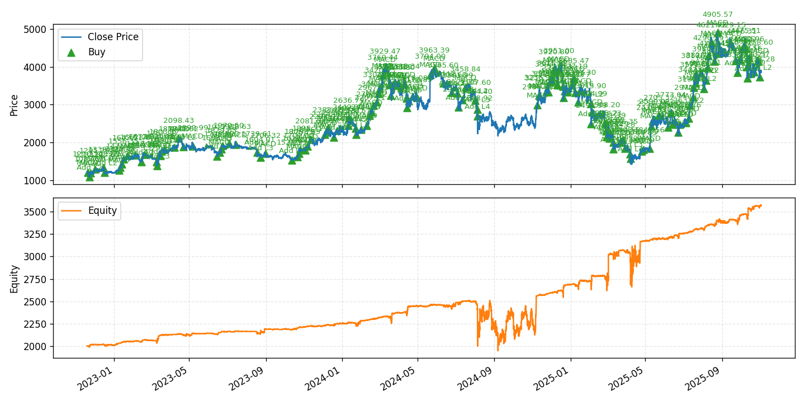
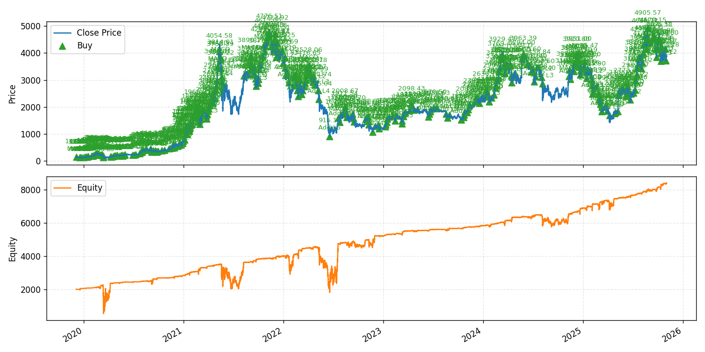

# Martingale Multi-Symbol Trading Bot

This repository contains a modular martingale trading framework targeting Binance spot markets. It provides:

- Backtesting against historical CSV data via Backtrader-style loops.
- Live execution on the Binance spot **testnet**, with optional Telegram notifications.
- A reusable architecture that separates strategy logic, portfolio/risk management, exchange access, and notification delivery.

> **Security notice:** `config/testnet.yaml` currently holds plain-text API credentials. Replace them with environment-variable references (e.g. `${BINANCE_TEST_KEY}`) before committing or sharing the repository.

## Overview / 项目简介

**English:** Multi-symbol martingale trading bot for Binance spot markets with pluggable signals, backtesting support, and testnet execution workflows.  
**中文：** 面向 Binance 现货市场的多标的马丁格尔交易框架，提供可插拔信号模块、回测工具以及测试网执行流程。

### Strategy Source / 策略来源

**English:** Inspired by the TradingView script [inwCoin Martingale Strategy for Bitcoin](https://www.tradingview.com/script/8OS1nbr8-inwCoin-Martingale-Strategy-for-Bitcoin/) and reimplemented in Python with multi-symbol support and customizable risk controls.  
**中文：** 策略灵感来自 TradingView 上的 [inwCoin Martingale Strategy for Bitcoin](https://www.tradingview.com/script/8OS1nbr8-inwCoin-Martingale-Strategy-for-Bitcoin/)，在此项目中以 Python 重新实现，扩展为多交易对并强化风险控制配置。

## Strategy Insights / 策略思路

**English:** The engine enters with a base position when indicator conditions align, then applies martingale-style scaling on drawdowns until reaching configured levels, while seeking to exit on predefined profit targets. Portfolio limits and cooldowns help cap total exposure per symbol.  
**中文：** 核心逻辑是在指标触发时建立初始仓位，价格回撤时按配置进行马丁格尔加仓，直至达到最大层数，并以固定收益目标止盈。同时结合资金上限与冷却时间限制，控制单品种的整体风险敞口。

## Dynamic Take-Profit Decay / 动态止盈机制

**English:** The martingale strategy now supports a time-aware profit target "TP(Δt) = max(tp_min, tp0 · e^{−Δt/τ})" that gradually lowers the required gain as a position ages. The parameters `take_profit_percent` (`tp0`), `take_profit_min_percent` (`tp_min`), and `take_profit_decay_hours` (`τ`) control the initial threshold, the floor, and the decay pace in hours. The entry timestamp is captured on every fill (weighted when layering in), so backtests and the Binance testnet runner evaluate the same decaying target on each bar. This smooth decay helps release capital during extended ranges without sacrificing early-trade upside.

**中文：** 马丁格尔策略新增基于持仓时间的动态止盈函数 "TP(Δt) = max(tp_min, tp0 · e^{−Δt/τ})"。通过 `take_profit_percent`（初始阈值 `tp0`）、`take_profit_min_percent`（止盈底线 `tp_min`）以及 `take_profit_decay_hours`（指数衰减时间常数 `τ`，单位：小时）即可调节衰减曲线。策略在每次买入时记录入场时间（多次加仓按权重更新），因此无论在回测还是 Binance 测试网环境中，都会基于同一时间衰减逻辑评估止盈条件，从而在长时间横盘阶段加速退出，同时保留初始行情中的盈利空间。

## Indicators / 指标细节

**English:** Entry logic can switch between MACD crossovers, Stochastic RSI recoveries, or an ATR-based trailing stop regime. Supporting utilities compute RSI, ATR, and MACD in pandas to mirror the TradingView setup.  
**中文：** 入场条件可在 MACD 金叉、Stochastic RSI 低位反弹以及基于 ATR 的趋势追踪之间切换，并通过 pandas 计算 RSI、ATR、MACD 等指标，以还原 TradingView 脚本中的信号设置。

## Risk Considerations / 风险提示

**English:** Martingale pyramiding magnifies position size during drawdowns, so budget sizing, max levels, and exchange liquidity need careful tuning. Always validate on historical data and sandbox/testnet environments before risking capital. Investing involves risk; this repository shares technical implementation guidance only.  
**中文：** 马丁格尔加仓会在下跌过程中迅速扩大持仓，务必谨慎设定资金规模、最大层数与交易所流动性约束。建议先在历史数据与测试网环境充分验证后再考虑实盘。投资有风险，仅分享技术。

## Project Structure

- `config/` – Environment-specific YAML configs (`backtest.yaml`, `testnet.yaml`).
- `core/` – Engine loop, configuration helpers, and portfolio management.
- `strategies/` – Strategy definitions (martingale with MACD/Stoch RSI/EMA triggers).
- `services/` – Exchange client integrations (Binance REST/WebSocket).
- `notifiers/` – Notification adapters (stdout, Telegram).
- `backtests/` – CSV-based backtest runner that mirrors live execution flow.

## Getting Started

1. **Install dependencies**
   ```bash
   pip install -r requirements.txt
   ```

2. **Prepare data for backtests**  
   Place historical candles in `data/ETHUSDT_1h.csv` (columns: `datetime,open,high,low,close,volume`).

3. **Run a backtest**
   ```bash
   python run_backtest.py -c config/backtest.yaml
   ```
   This outputs summary metrics and saves equity curve snapshots for different lookback windows.

   
   
   

4. **Configure testnet credentials**  
   Export your Binance spot testnet keys (recommended) or edit `config/testnet.yaml`:
   ```powershell
   $env:BINANCE_TEST_KEY  = "your_testnet_key"
   $env:BINANCE_TEST_SECRET = "your_testnet_secret"
   ```

5. **Launch live testnet session**  
   ```bash
   python run_testnet.py -c config/testnet.yaml
   ```
   The runner subscribes to multi-symbol klines, processes signals per bar, places testnet orders, and emits log snapshots + notifications.

## Docker Usage

Build the container image:
```bash
docker build -t martingale-bot .
```

Run a backtest (mount your historical data folder if needed):
```bash
docker run --rm \
  -v "$(pwd)/data:/app/data" \
  martingale-bot
```

Run against Binance spot testnet (make sure environment variables are set and any data/config overrides are mounted):
```bash
docker run --rm \
  -e MODE=testnet \
  -e CONFIG_FILE=config/testnet.yaml \
  -e BINANCE_TEST_KEY=$BINANCE_TEST_KEY \
  -e BINANCE_TEST_SECRET=$BINANCE_TEST_SECRET \
  -e TELEGRAM_BOT_TOKEN=$TELEGRAM_BOT_TOKEN \
  -e TELEGRAM_CHAT_ID=$TELEGRAM_CHAT_ID \
  martingale-bot
```
The entrypoint selects the `MODE` (`backtest` by default or `testnet`) and uses `CONFIG_FILE` to locate the YAML configuration inside the container.

## Configuration Highlights

- **Multi-symbol** support via `exchange.symbols` (each symbol uses its own portfolio instance and cash budget).
- **Risk controls** (`risk.max_notional`, `cooldown_minutes`) limit martingale exposure.
- **Notifications** – Enable Telegram by setting `notifications.telegram.enabled` to `true` and providing `bot_token` & `chat_id`.

## Development Notes

- Logs: strategy-level indicator snapshots are emitted once per completed bar (e.g. every minute if `interval: 1m`).
- Testing: you can quickly sanity-check indicator logic with local CSVs using the provided backtest runner.
- Secrets: store API keys outside of version control (environment variables, secret managers). Update configs accordingly before publishing.

## Suggested Next Steps

1. Replace hard-coded credentials with `${ENV_VAR}` placeholders and document required environment variables.
2. Add unit tests covering `PortfolioManager.process_signal` and strategy edge cases.
3. Extend `notifications/` with additional channels (e.g., email, webhook) if needed.
